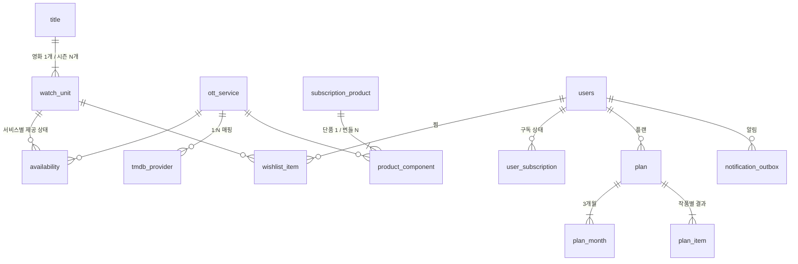
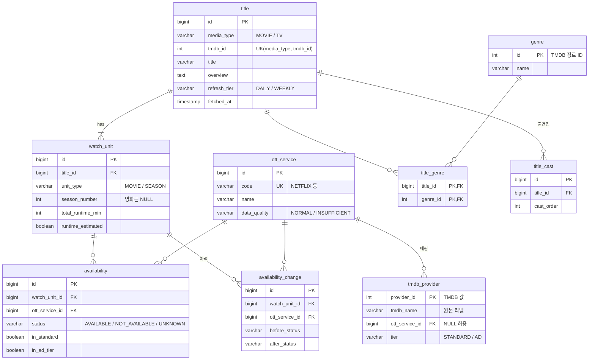
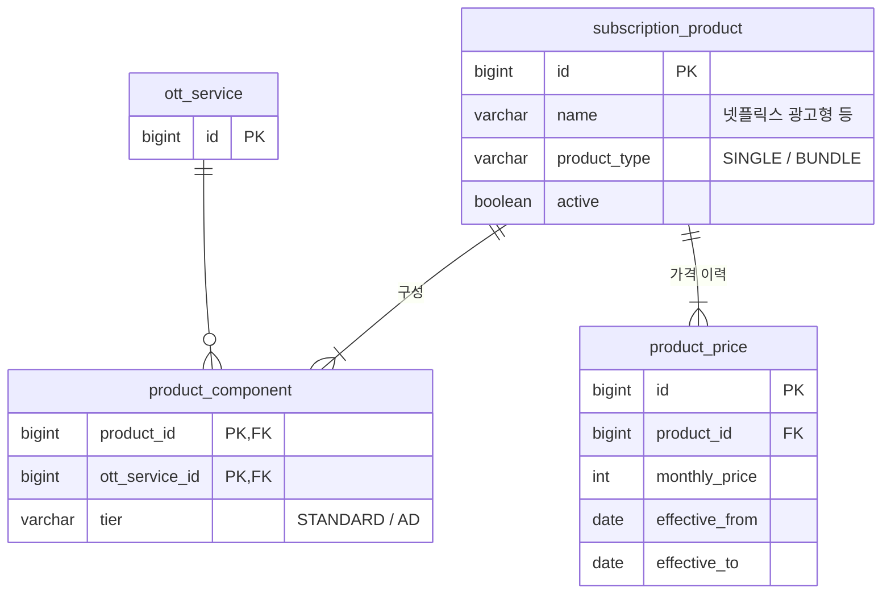
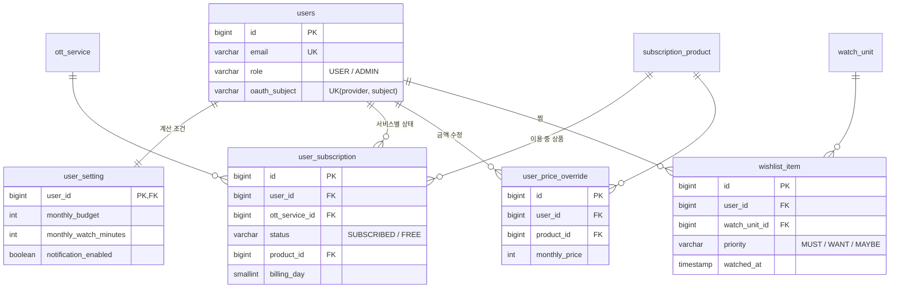
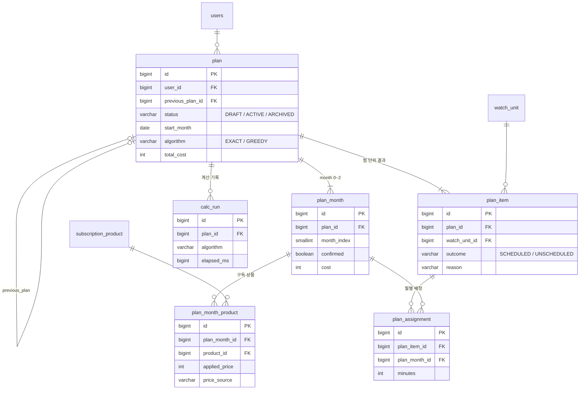

# OTT내비(ottnavi) ERD

초안 v0.3 · 2026-10-03 · PostgreSQL 15+ (Supabase) · Spring Data JPA + Flyway

서비스 테이블 24개를 다섯 영역으로 나눴다. 라이브러리가 관리하는 테이블(`BATCH_*`, `shedlock`)은 이 숫자에서 뺐다. 모든 테이블은 내부 대리키(`id BIGINT`)를 기본키로 쓰고, TMDB 값은 매핑 컬럼과 유니크 제약으로 보관한다. 영화와 드라마 시즌은 `watch_unit`(시청 단위)으로 통일해 찜, 제공 상태, 계산이 모두 이 테이블을 기준으로 동작한다.

- 공통 감사 컬럼 `created_at`, `updated_at`(TIMESTAMPTZ)은 표에서 생략한다.
- 키 표기: **PK** 기본키, **FK** 외래키, **UK** 유니크 제약

---

## 0. 전체 구조

영역 간 연결만 표시했다.

---

## A. 작품·데이터 영역

TMDB에서 수집한 데이터다. 수집 배치만 쓰고, 공개 API(검색·상세·독점 목록)와 계산 엔진이 읽는다.

### ott_service — 우리 7개 서비스

| 컬럼 | 타입 | 키 | 설명 |
|---|---|---|---|
| id | BIGINT | PK | 내부 키 |
| code | VARCHAR(30) | UK | NETFLIX, DISNEY_PLUS, APPLE_TV_PLUS, TVING, WAVVE, WATCHA, COUPANG_PLAY |
| name | VARCHAR(50) | | 화면 표시 이름 |
| logo_path | VARCHAR(200) | | TMDB 이미지 상대 경로 |
| display_order | INT | | 화면 정렬 순서 |
| data_quality | VARCHAR(20) | | NORMAL / INSUFFICIENT. 쿠팡플레이는 INSUFFICIENT |

### tmdb_provider — TMDB 제공처와 서비스 매핑

| 컬럼 | 타입 | 키 | 설명 |
|---|---|---|---|
| provider_id | INT | PK | TMDB 값 그대로 (8, 1796 등). 외부 값이 안정적인 식별자라 대리키를 두지 않는다 |
| tmdb_name | VARCHAR(100) | | TMDB 원본 라벨. 관리자 확인용이며 판정에 쓰지 않는다 |
| logo_path | VARCHAR(200) | | |
| ott_service_id | BIGINT | FK | 우리 판정. 관심 없는 제공처는 NULL |
| tier | VARCHAR(20) | | STANDARD / AD. 우리 판정 |
| first_seen_at | TIMESTAMPTZ | | 처음 발견된 시각. 미매핑 제공처를 관리자가 확인하는 데 쓴다 |

### title — 작품 (영화·드라마 공통)

| 컬럼 | 타입 | 키 | 설명 |
|---|---|---|---|
| id | BIGINT | PK | 내부 키. 다른 테이블은 이것만 참조 |
| media_type | VARCHAR(10) | UK | MOVIE / TV |
| tmdb_id | INT | UK | `UNIQUE(media_type, tmdb_id)`로 영화·드라마 ID 충돌 해결 |
| title | VARCHAR(300) | | 한국어 제목 (없으면 원제) |
| original_title | VARCHAR(300) | | 영화 original_title / 드라마 original_name |
| overview | TEXT | | 줄거리 |
| overview_lang | VARCHAR(5) | | ko / en. 영어로 대체했는지 표시 |
| release_date | DATE | | 영화 개봉일 / 드라마 첫 방영일 |
| poster_path, backdrop_path | VARCHAR(200) | | 이미지 상대 경로 |
| original_language | VARCHAR(10) | | |
| tv_status | VARCHAR(30) | | 드라마만. Returning Series, Ended 등 |
| popularity, vote_average | NUMERIC | | 정렬과 수집 우선순위 |
| refresh_tier | VARCHAR(10) | | DAILY(찜에 있음) / WEEKLY(나머지 후보) |
| fetched_at | TIMESTAMPTZ | | 마지막 수집 시각. 6개월 갱신 규칙 점검에 사용 |

### watch_unit — 시청 단위 (영화 1편 또는 시즌 1개)

| 컬럼 | 타입 | 키 | 설명 |
|---|---|---|---|
| id | BIGINT | PK | |
| title_id | BIGINT | FK, UK | → title |
| unit_type | VARCHAR(10) | | MOVIE / SEASON |
| season_number | INT | UK | 영화는 NULL. `UNIQUE(title_id, season_number) NULLS NOT DISTINCT`. 시즌 0(스페셜)은 수집하지 않음 |
| tmdb_season_id | INT | | 시즌만 |
| name, poster_path, air_date | — | | 시즌 표시용 (영화는 title 값 사용) |
| episode_count | INT | | 전체 회차 수 (영화는 1) |
| aired_episode_count | INT | | 방영된 회차 수 |
| total_runtime_min | INT | | 방영된 회차 runtime 합 / 영화 runtime |
| runtime_missing_count | INT | | runtime이 비어 기본값을 쓴 회차 수 |
| runtime_estimated | BOOLEAN | | 추정값 포함 여부 (화면 "추정" 표시) |
| fetched_at | TIMESTAMPTZ | | |

### availability — 시청 단위 × 서비스 제공 상태

| 컬럼 | 타입 | 키 | 설명 |
|---|---|---|---|
| id | BIGINT | PK | |
| watch_unit_id | BIGINT | FK, UK | `UNIQUE(watch_unit_id, ott_service_id)` |
| ott_service_id | BIGINT | FK, UK | |
| status | VARCHAR(20) | | AVAILABLE / NOT_AVAILABLE / UNKNOWN. 엔티티 메서드 하나에서만 변경 |
| unknown_reason | VARCHAR(30) | | NO_KR_DATA(응답에 KR 없음) / STRUCTURAL_GAP(쿠팡플레이 영화 등) |
| in_standard | BOOLEAN | | STANDARD tier 제공처가 있었는지 |
| in_ad_tier | BOOLEAN | | AD tier 제공처가 있었는지 (광고형 요금제 판정) |
| checked_at | TIMESTAMPTZ | | 마지막 확인 시각 |

### availability_change — 제공 상태 변경 이력

| 컬럼 | 타입 | 키 | 설명 |
|---|---|---|---|
| id | BIGINT | PK | |
| watch_unit_id, ott_service_id | BIGINT | FK | |
| before_status, after_status | VARCHAR(20) | | 신규는 before가 NULL |
| job_execution_id | BIGINT | | Spring Batch 실행 ID (FK 없이 참조값만) |
| changed_at | TIMESTAMPTZ | | 재계산·변경 알림의 입력 |

### genre / title_genre / title_cast — 상세 화면용 부속 데이터

| 테이블 | 컬럼 | 설명 |
|---|---|---|
| genre | id INT PK, name | TMDB 장르 ID를 그대로 PK로 사용. 애니메이션(16) 판별 |
| title_genre | PK(title_id, genre_id) | N:M 연결 테이블 |
| title_cast | id PK, title_id FK, cast_order, person_tmdb_id, name, character_name, profile_path | 상위 10명만 저장. `UNIQUE(title_id, cast_order)`. 인물 테이블은 두지 않음 |

---

## B. 상품·요금 영역

요금제와 번들을 "구독 상품" 하나로 통일했다. 단품은 구성 서비스가 1개인 상품이고, 번들은 여러 개인 상품이다. 계산 엔진은 상품을 하나의 선택지(가상 서비스)로 다룬다.

| 테이블 | 핵심 컬럼 | 설명 |
|---|---|---|
| subscription_product | id, name, product_type, active | 관리자가 등록. 판매 종료 상품은 active=false (삭제하지 않음) |
| product_component | PK(product_id, ott_service_id), tier | 상품에 포함된 서비스와 tier. tier=AD면 해당 서비스 작품 중 in_ad_tier만 커버. MVP는 STANDARD 단품만 다루고, AD tier는 2단계(O3)에서 번들과 함께 추가한다(스키마는 미리 준비) |
| product_price | id, product_id FK, monthly_price, effective_from, effective_to | `UNIQUE(product_id, effective_from)`. 적용 시작일 기준으로 가격을 고르고, 기간이 겹치지 않게 서비스에서 검증 (FR-19) |

---

## C. 사용자 영역

로그인한 사용자의 입력이다. 탈퇴(FR-07)하면 이 영역과 D·E 영역의 사용자 데이터를 함께 삭제한다.

| 테이블 | 핵심 컬럼 | 설명 |
|---|---|---|
| users | id, email UK, name, role, oauth_provider, oauth_subject | `UNIQUE(oauth_provider, oauth_subject)`. 테이블명은 예약어(user)를 피하려고 복수형 |
| user_setting | user_id PK·FK, monthly_budget, monthly_watch_minutes, watch_preset, notification_enabled | 1:1. 예산·시청 시간 필수(FR-10). watch_preset = LIGHT / NORMAL / HEAVY / CUSTOM |
| user_subscription | id, user_id FK, ott_service_id FK, status, product_id FK NULL, billing_day | `UNIQUE(user_id, ott_service_id)`. 미구독은 행을 두지 않는다. billing_day 기본값 1. 번들 이용 시 구성 서비스 행들이 같은 product_id를 가리킨다 |
| user_price_override | id, user_id FK, product_id FK, monthly_price | `UNIQUE(user_id, product_id)`. 관리자 가격을 바꾸지 않는 사용자별 덮어쓰기(FR-11) |
| wishlist_item | id, user_id FK, watch_unit_id FK, priority, watched_at NULL | `UNIQUE(user_id, watch_unit_id)`. 드라마 찜은 시즌별 행으로 저장. watched_at이 있으면 계산에서 제외 |

---

## D. 플랜 영역

계산 결과는 그 시점의 가격과 조건을 스냅샷으로 저장한다. 계산과 저장은 분리되어 있다. 계산하면 `DRAFT` plan이 생기고(사용자당 1개, 새로 계산하면 덮어씀), 사용자가 저장하면 `DRAFT`가 `ACTIVE`가 되면서 기존 `ACTIVE`는 `ARCHIVED`로 바뀐다. 매월 자동 재계산은 `DRAFT`를 거치지 않고 바로 새 `ACTIVE`를 만들고 이전 plan을 `ARCHIVED`로 바꾼다. 이렇게 하면 "무엇이 왜 바뀌었는지"를 두 plan을 비교해서 설명할 수 있다.

| 테이블 | 핵심 컬럼 | 설명 |
|---|---|---|
| plan | id, user_id FK, previous_plan_id FK NULL, status, start_month, monthly_budget, monthly_watch_minutes, algorithm, must_total, must_completed, score, total_cost, all_subscribe_cost, data_as_of, change_summary | status = DRAFT(계산했지만 저장 안 함) / ACTIVE(저장한 현재 플랜, 알림·매월 재계산의 기준) / ARCHIVED(물러난 이전 플랜). 사용자당 ACTIVE는 하나: `UNIQUE(user_id) WHERE status = 'ACTIVE'`, 사용자당 DRAFT도 하나: `UNIQUE(user_id) WHERE status = 'DRAFT'` 부분 인덱스. DRAFT를 덮어쓸 때 하위 plan_month·plan_item·plan_month_product·plan_assignment 행도 함께 삭제한다(FK `ON DELETE CASCADE`로 DB가 지운다. 아래 "삭제 정책" 참고). 저장 시 DRAFT의 data_as_of가 최신 수집보다 오래됐으면 서비스에서 막는다. 예산·시청 시간은 계산 당시 값의 스냅샷. 절감액 = all_subscribe_cost − total_cost |
| plan_month | id, plan_id FK, month_index, month, confirmed, cost | `UNIQUE(plan_id, month_index)`. month_index 0은 확정(이번 달), 1·2는 예상 |
| plan_month_product | id, plan_month_id FK, product_id FK, applied_price, price_source | 그 달에 구독할 상품. price_source = ADMIN / USER_OVERRIDE / ALREADY_PAID / FREE. 가격 스냅샷이라 이후 가격 변경에 영향받지 않음. 가입·해지 안내는 인접 월을 비교해 도출 |
| plan_item | id, plan_id FK, watch_unit_id FK, priority, outcome, reason, completed_month_index | `UNIQUE(plan_id, watch_unit_id)`. reason = BUDGET(예산 부족) / TIME(시청 시간 초과) / UNKNOWN(제공처 정보 없음: 7개 중 "있음"은 없고 "모름"이 있음) / NO_PROVIDER(7개 서비스에 없음: 7개 모두 "없음"). 판정 순서는 NO_PROVIDER → UNKNOWN → BUDGET → TIME. "남은 작품과 이유"(FR-12)의 원천 |
| plan_assignment | id, plan_item_id FK, plan_month_id FK, ott_service_id FK, minutes | `UNIQUE(plan_item_id, plan_month_id)`. 긴 시즌은 연속된 달에 걸쳐 여러 행으로 나뉨 |
| calc_run | id, plan_id FK NULL, input_hash, algorithm, must_completed, score, total_cost, candidate_count, elapsed_ms | 정확해와 그리디 비교 기록(FR-13). 같은 input_hash로 두 알고리즘 결과를 비교. 플랜이 삭제되면 plan_id만 NULL |

---

## E. 알림·운영 영역

| 테이블 | 핵심 컬럼 | 설명 |
|---|---|---|
| notification_outbox | id, user_id FK, type, dedupe_key UK, payload JSONB, status, attempt_count, next_attempt_at, sent_at, last_error | type = SUBSCRIBE_GUIDE / MONTHLY / PLAN_CHANGE. status = PENDING / SENT / FAILED. 인덱스 (status, next_attempt_at), user_id(탈퇴 삭제용). 발송 이력 조회(FR-16)도 이 테이블. dedupe_key 예: `MONTHLY:{userId}:2026-11` |
| BATCH_* (Spring Batch) | 라이브러리 관리 | 수집 실행 이력. 생성 스크립트만 Flyway에 추가. 관리자 화면(FR-20)이 읽기 전용으로 조회 |
| shedlock | 라이브러리 관리 | @Scheduled 작업 락. 생성 스크립트만 Flyway에 추가 |

**DB에 두지 않는 것:**
- Refresh Token: Redis, TTL 적용
- 요청 제한 버킷: Redis, Bucket4j
- 캐시: 작품 상세, 독점 목록, 계산 결과 (Redis)

독점 목록은 availability에서 계산해 캐시하므로 별도 테이블이 없다.

---

## 설계 결정

- **대리키 + 복합 유니크.** TMDB ID는 영화와 드라마가 겹칠 수 있다. 그래서 `UNIQUE(media_type, tmdb_id)`로 중복을 막고, 내부 참조는 `id` 하나로 단순하게 유지한다. 예외는 `tmdb_provider`와 `genre`다. 외부 ID가 유일하고 안정적이라 그대로 PK로 쓴다.
- **시청 단위 통일.** 찜, 제공 상태, 플랜 배정이 모두 `watch_unit`을 참조한다. 계산 엔진은 영화와 시즌을 구분하지 않는다. 작품 단위 제공 상태는 저장하지 않고 시즌 상태에서 도출한다.
- **서비스와 제공처 분리 (3NF).** 서비스 속성은 `ott_service`에만 있다. `tmdb_name`은 외부 원본 라벨이고, `ott_service_id`와 `tier`는 우리 판정이다.
- **서비스 단위 집계 저장.** 원본(시청 단위 × 제공처) 대신 서비스 단위로 집계해 저장한다. 조회 성능을 위한 판단이다. 광고형 판정에 필요한 정보는 tier 플래그로 유지한다.
- **요금제와 번들을 상품으로 통일.** 사용자 구독, 금액 수정, 플랜이 모두 `product_id` 하나만 참조한다. 단품과 번들을 구분하는 분기가 사라진다.
- **계산 결과는 스냅샷.** 가격과 조건을 플랜에 복사해 저장하므로, 이후 가격이 바뀌어도 과거 결과는 변하지 않는다. 재계산은 새 플랜을 만들고 이전 플랜과 연결한다.
- **삭제 정책.** FK `ON DELETE CASCADE`로 DB가 하위 행을 지운다(확정, TECH T-1). 사용자가 탈퇴하면 `users` 행 하나를 지워 C·D·E 영역의 사용자 행이 함께 삭제되고, DRAFT를 덮어쓸 때도 같은 규칙을 쓴다. calc_run은 통계용으로 남기고 plan_id만 NULL로 바꾼다. JPA 엔티티에는 cascade 삭제(`CascadeType.REMOVE`, `orphanRemoval`)를 걸지 않고 plan 삭제는 벌크 JPQL로 한다. FK 동작은 Flyway 스크립트가 기준이고(`ddl-auto=validate`는 FK의 ON DELETE까지 검사하지 않는다), Testcontainers 테스트로 고정한다.

**FK 삭제 동작**

| 자식 FK | 부모 | 동작 |
|---|---|---|
| plan_month.plan_id, plan_item.plan_id | plan | CASCADE |
| plan_month_product.plan_month_id | plan_month | CASCADE |
| plan_assignment.plan_item_id, plan_assignment.plan_month_id | plan_item, plan_month | CASCADE (두 경로 모두) |
| calc_run.plan_id | plan | SET NULL (통계용으로 남김) |
| plan.previous_plan_id | plan | SET NULL (자기참조 삭제 순서 문제 방지) |
| user_setting, user_subscription, user_price_override, wishlist_item, plan, notification_outbox의 user_id | users | CASCADE (탈퇴) |
| 마스터 데이터를 가리키는 FK(watch_unit, ott_service, subscription_product 등) | — | NO ACTION 유지 |

**참조 컬럼 인덱스.** PostgreSQL은 FK를 거는 쪽(자식) 컬럼에 인덱스를 자동으로 만들지 않아, 삭제 때 자식 테이블 전체를 훑지 않도록 아래를 추가한다. 유니크 인덱스의 선두 컬럼으로 이미 덮이는 FK(plan_month·plan_item의 plan_id, plan_assignment의 plan_item_id, user_subscription·user_price_override·wishlist_item의 user_id)는 따로 만들지 않는다.
- `plan_month_product(plan_month_id)`, `plan_assignment(plan_month_id)`, `calc_run(plan_id)`, `plan(previous_plan_id)`
- `plan(user_id)`: 유니크 인덱스가 ACTIVE·DRAFT 행에만 걸려 ARCHIVED 행은 덮이지 않는다.
- `notification_outbox(user_id)`

**벌크 삭제 전제.** 벌크 JPQL은 1차 캐시를 갱신하지 않으므로 서비스는 `@Modifying(flushAutomatically = true, clearAutomatically = true)`로 삭제하고 트랜잭션의 첫 동작으로 둔다(TECH 6절). Redis의 Refresh Token과 캐시는 DB cascade 대상이 아니라 탈퇴 서비스가 별도로 지운다.
