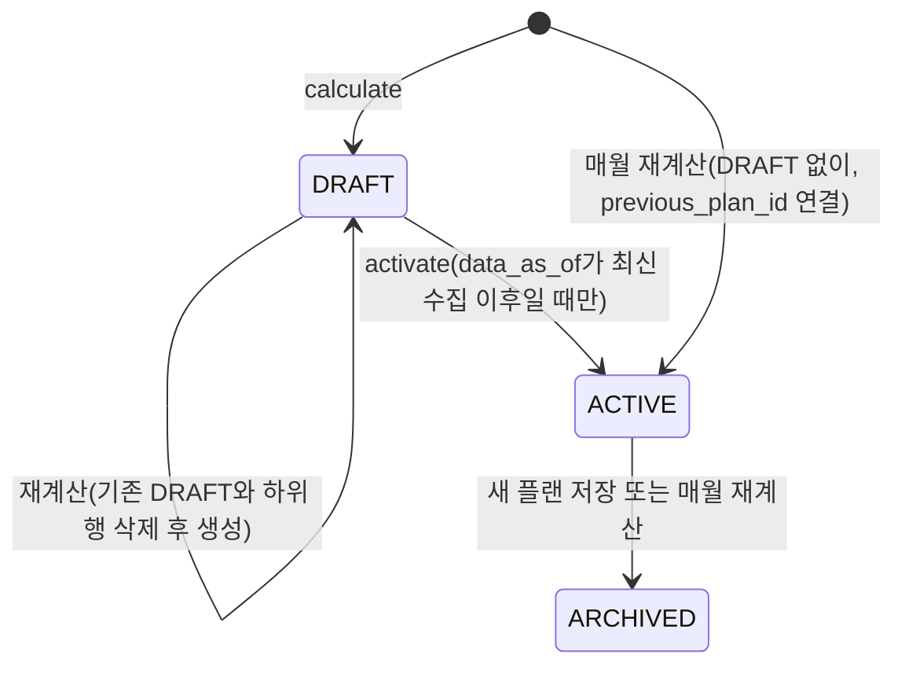
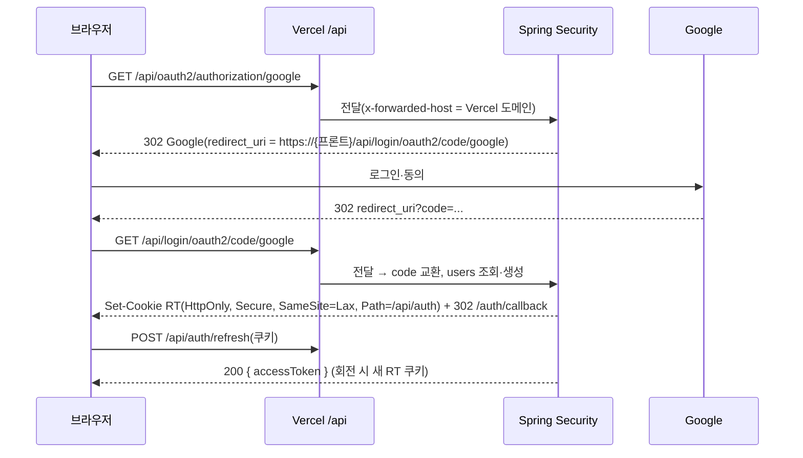

# OTT내비(ottnavi) TECH — 설계 결정과 함정

이 문서는 [PRD](./PRD.md), [ERD](./ERD.md), [backend.md](../.claude/rules/backend.md), [frontend.md](../.claude/rules/frontend.md), [api-contract.md](../.claude/rules/api-contract.md)에 **없는** 설계 결정과 검증 중 발견한 함정만 다룬다. 요구사항·스키마·코딩 규칙·스택 목록은 위 문서가 기준이고, 여기서는 반복하지 않는다.

- 근거 우선순위: PRD 11절 확정 → PRD 본문 → ERD → rules. [기획서](./proposal_v6.md)는 v7 요약본이라 근거로 쓰지 않는다.
- 출처 표기: `R`=PRD, `E`=ERD, `rules`, `c7`=context7 확인, `web`=공식 문서 확인, `도출`=문서 근거 없이 이 문서에서 정한 설계.
- PRD 11절의 결정 필요 항목은 `R11-번호`로, 이 문서가 올린 결정 필요 항목은 `T-번호`로 참조한다. T 항목은 7절이 단일 출처다.
- 저장소 상태(2026-10-04): `backend/`·`frontend/`·`docs/api/`·`infra/` 골격이 생겼고 CI(`.github/workflows/`)와 `vercel.json`은 아직 없다. 스택은 rules를 따르고, 확인한 버전은 6절에 적는다.

---

## 1. 계산 엔진 (FR-12·13)

> 결정 현황: T-1~T-8 확정, T-9 결정 필요(7절).

계산 규칙의 정의는 R 5.4(FR-12)가 기준이다. `ExactSolver`와 `GreedySolver`는 `PlanSolver` 하나를 구현하고(rules), 배정 규칙은 공유한다. 두 구현의 차이는 "구독 조합을 고르는 방법"뿐이다. 목적함수는 **비교기와 시작 조합(baseline)을 묶은 `PlanObjective`를 `solve(input, PlanObjective)`의 인자로 받는다**(플랜 유형별 기준, PRD 11절 35번. 추천형은 baseline이 없고, 절약형·간편형은 추천형 결과의 조합이 baseline이다). `solve(input)`은 `PlanObjective.recommended(input)`으로 위임한다. 알고리즘 전체 설명은 `docs/ENGINE_ALGORITHM.md`.

**목적함수 비교(사전식, 추천형).** ① `mustCompleted` 큰 쪽 → ② `score`(WANT 2, MAYBE 1) 큰 쪽 → ③ `totalCost` 작은 쪽 → ④ 모두 같으면 **조기 시청**(달 0→1→2 순서로 "그 달까지(포함) 시청 완료한 꼭 작품 수, 같으면 점수 합"을 비교해 먼저 다른 달에서 큰 쪽. 시청 완료 달은 `UnitResult.completedMonthIndex`, 점수는 그 달에 얻는다고 본다. 예: 같은 점수·비용이면 `[[1],[2,3],[]]`이 `[[],[1],[2,3]]`보다 좋다. 2026-10-10 사용자 결정) → ⑤ **결제 미루기**(달 0→1→2 순서로 그 달에 **새로 돈이 드는 상품 수**를 비교해 먼저 다른 달에서 적은 쪽, FREE와 이번 달 이미 낸 SUBSCRIBED는 세지 않음. 2026-10-09 사용자 결정, 2026-10-10에 ④에서 ⑤로 내려감: 맨 앞에 두면 같은 점수·비용일 때 항상 가장 늦은 달에 구독해 첫 달을 비우고 매월 재계산하면 결제가 영원히 미뤄진다) → ⑥ 그래도 같으면 달별 상품 ID 사전순(도출: 정답 테스트를 결정적으로 만들기 위해).

**플랜 유형별 비교기(2026-10-09 사용자 결정, PRD 5.4·11절 35번).** 세 유형 모두 ① `mustCompleted` 큰 쪽으로 시작한다. 절약형·간편형은 `minScore = ceil(추천형 score × 0.7)`를 쓰므로 **추천형을 먼저 풀고** 그 점수로 비교기를 만든다(도출).
- 절약형: ① → ② `score >= minScore`인 쪽 → ③ `totalCost` 작은 쪽 → ④ `score` 큰 쪽 → ⑤ 조기 시청 → ⑥ 결제 미루기 → ⑦ 달별 상품 ID 사전순.
- 간편형: ① → ② `score >= minScore`인 쪽 → ③ **새로 가입하는 횟수**(어떤 달에 선택했고 지난달에는 선택하지 않은 상품마다 1회, `SUBSCRIBED` 상품은 0번째 달에도 구독한 것으로 봄, 연속 유지는 다시 세지 않음. 2026-10-09 사용자 결정) 작은 쪽 → ④ `totalCost` 작은 쪽 → ⑤ `score` 큰 쪽 → ⑥ 조기 시청 → ⑦ 결제 미루기 → ⑧ 달별 상품 ID 사전순.
- 동치 제거(아래 "완전탐색")는 추천형에서만 쓴다. 절약형·간편형 완전탐색은 후보 상품으로 만든 예산 이하 모든 조합을 훑는다(간편형의 가입 횟수는 앞뒤 달 선택에 걸려 있어서 달별로 독립적인 대표 선정이 성립하지 않는다. MVP 최대 약 210만 평가, 유형 3개라 약 3배. Task 040에서 측정했고 단위 30개 기준 절약형 약 1.6초·간편형 약 1.8초). 완전탐색 결과는 해당 유형 비교기로 후보 상품의 모든 조합을 평가해 고른 최선과 같아야 한다.
- 세 유형의 결과 `selection`이 같으면 응답은 하나로 합치고 유형 이름을 함께 보여준다(화면).

**배정 규칙(고정).**
- 정렬: 시청 가능 상품이 없는 단위(NO_PROVIDER·UNKNOWN)는 시간을 쓰지 않으므로 맨 뒤(결과 목록 순서만 바뀜) → 우선순위 높은 순 → 필요 분 짧은 순 → `watchUnitId` 순(마지막 기준은 도출). 정렬은 `PlanInput` 생성자가 한 번 하고 불변으로 보관한다.
- 볼 수 있는 가장 이른 달부터 남은 시청 시간에 채운다. 한 달보다 긴 시즌은 그 시즌을 볼 수 있는 상품이 선택된 **연속된 달**에 서비스와 상관없이 이어서 나눠 배정하고(예: 1월 넷플릭스, 2월 티빙, 2026-10-09 사용자 결정) 다 본 달에 점수를 준다. 실제로 시청하는 달도 연속이어야 해서 가운데 달의 배정이 0분이면 이어 보기가 끊긴 것으로 보고 나눌 수 없으며(미배정, 일부 배정 시간은 풀림), 마지막 조각을 빼고 한 달에 최소 120분(`MIN_LONG_SEASON_SEGMENT_MINUTES`, R11-34)씩 나눠 본다(시작 달의 남은 시간이 120분 미만이면 다음 달부터 시도, 이어 가는 달의 남은 시간이 잔여 분보다 적으면서 120분 미만이면 끊긴 것으로 봄, 월 시청 가능 시간이 120분 미만이면 긴 시즌은 시작할 수 없음). 달마다 어느 상품으로 본 분량인지를 기록하고(같은 달에 볼 수 있는 상품이 둘이면 ID가 작은 쪽), 월 시청 가능 시간은 서비스와 무관하게 그 달 전체에서 센다. 3개월 안에 끝나지 않으면 배정하지 않는다(도출).
- 번들은 상품 하나로 다루고 "모름"은 시청 가능으로 세지 않는다(R). SUBSCRIBED 상품은 평가기가 0번째 달에 선택에 없어도 비용 0으로 시청 가능한 것으로 취급한다(1·2번째 달은 선택해야 유지되고 가격이 든다). 쿠팡플레이 포함 여부(R11-13)는 입력 단계 필터로 받아 엔진은 바뀌지 않는다. 다만 `plan` 변환(Task 063)이 상품을 걸러낼 때 단위의 시청 가능 상품 ID 집합에서도 같은 상품을 함께 걸러야 한다(`PlanInput` 생성자는 시청 가능 상품 ID가 `products`에 없으면 예외를 던진다). 상품은 최대 32개까지 평가할 수 있다(`Evaluator`의 `int` 비트마스크 한계, 2단계에서 더 필요하면 `long`으로 확장).

**시즌 순서 규칙(2026-10-10 사용자 결정, PRD 5.4·11절 37번, 구현 완료: Task 040 후속 항목 S).** 배정 규칙에 제약이 하나 더해진다. 같은 시리즈(`title_id`가 같음)의 시즌은 번호 순서대로 시청 완료하고, 뒤 시즌의 시청 완료 달은 앞 시즌의 시청 완료 달 이상이어야 한다(같은 달이면 앞 시즌을 먼저 보는 것으로 봄). 앞 시즌이 찜 목록에 없거나 "다 봤음"이면 제약이 없고(찜 목록에 있는 직전 시즌만 기준), 앞 시즌이 3개월 안에 시청 완료되지 못하면 뒤 시즌은 미배정이다(이유 코드는 기존 4종 중 TIME으로 확정. 단 뒤 시즌 자신의 서비스가 어느 달에도 선택되지 않았으면 기존 순서대로 BUDGET/NO_PROVIDER/UNKNOWN). 시작 달은 제약하지 않아서 뒤 시즌이 앞 시즌의 시청 완료 달보다 먼저 시작해도 되고, 제약은 시청 완료 달 비교뿐이다(확정). 이 변경이 엔진에 준 영향은 다음과 같고 모두 구현됐다. 구현은 `PlanInput`의 `pullUpEarlierSeasons`(정렬 뒤 앞 시즌 끌어올리기)와 `Evaluator`의 `prereqIndexes`·`blockedAlways`(배정할 때 앞 시즌 완료 달 확인), 검증은 독립 구현 `OracleAssigner` 대조다. 동작 설명은 `docs/ENGINE_ALGORITHM.md` 3.6절·5.3절·11절.
- **모델 변경.** 시청 단위(`WatchUnit`)가 시리즈 식별자와 시즌 번호를 가져야 한다(영화는 시즌 번호 없음). `PlanInput`은 이를 검증하고 정렬 기준과 함께 불변으로 보관한다. `plan` 입력 변환(Task 063)이 `title_id`·`season_number`를 채운다.
- **배정 규칙 변경.** 배정 규칙(`Evaluator`)의 정렬(시청 가능 없음 → 우선순위 → 필요 분 → ID)과 이 제약이 충돌할 수 있다(예: 뒤 시즌이 우선순위가 높거나 짧아서 먼저 배정되는 경우). 풀이 방향은 **앞 시즌 끌어올리기로 확정**(2026-10-10 사용자 결정, A안, 구현 정의는 같은 날 설계 검토로 정정)이다. (1) 방식: 기존 정렬(시청 가능 여부 → 우선순위 → 필요 분 → ID)로 정렬한 뒤 한 번 훑으면서, 어떤 시즌을 내보낼 때 같은 시리즈의 아직 나오지 않은 앞 시즌들을 시즌 번호 순으로 그 시즌 바로 앞에 끼워 넣는다. 그래서 앞 시즌이 항상 뒤 시즌보다 먼저 배정된다. 우선순위와 상관없이 적용한다(뒤 시즌이 WANT이면 MAYBE인 앞 시즌도 당겨진다). 점수와 꼭 시청 완료 수는 각 시즌의 원래 우선순위를 쓰고 필요 분·ID 순도 원래 값이다. 앞 시즌이 찜 목록에 없거나 "다 봤음"이면 끌어올릴 대상이 없다. (2) 끌어올림 제외: 뒤 시즌이나 그 앞 시즌 중에 "정적으로 시청 완료가 불가능한" 시즌이 하나라도 있으면 그 시즌을 내보낼 때는 앞 시즌을 끌어올리지 않는다(그 뒤 시즌은 어차피 TIME이라 앞 시즌이 시간을 선점하면 손해). 정적 불가능: ① FREE·SUBSCRIBED 상품이 아니면서 예산 안의 후보 상품이 하나도 없음(어느 상품으로도 볼 수 없거나 항상 예산 초과), ② 필요 분 > 3개월 시청 용량(월 시청 시간 × 3), ③ 긴 시즌(한 달 시청 시간보다 김)인데 월 시청 시간 < 120분. 시청 불가(볼 수 있는 상품이 전혀 없음) 단위는 기존처럼 맨 뒤에 둔다. (3) 한계: 배정은 "가능한 만큼 채우는" 규칙이라, 예를 들어 월 300분이고 앞 시즌이 마지막 달에 250분으로 시청 완료되고 뒤 시즌이 400분이면 뒤 시즌은 TIME이 될 수 있다(나눠 보면 가능한 경우도 포함). 이 한계는 정답 세트 케이스(15~21)로 고정했다. (4) 알려진 모서리: 예산 밖 조합을 평가기에 직접 넣으면 평가기가 정적 불가능 판정을 조합과 무관하게 쓰기 때문에 오라클과 결과가 어긋날 수 있어 그 경우는 정의하지 않는다. Solver는 달마다 예산 이하 조합만 넘기므로 운영 경로에는 영향이 없다(`KnownCornerOffBudgetTest`로 고정). 나머지 세부(시작 달 비제약, TIME 이유 코드)는 PRD 5.4를 따른다.
- **재검증(완료).** (1) 038의 정답 테스트(T1~T20)는 시즌 번호가 없는 단위로 그대로 통과하고, 시즌 순서 케이스(같은 달, 앞 시즌 미완료, 찜 목록에 앞 시즌 없음 등)를 정답 세트 15~21로 추가했다. (2) 039 S7 동치 제거는 "그 달에 볼 수 있게 되는 시청 단위 집합이 같으면 배정·시청 완료 달이 같다"는 전제 위에 있는데, 시즌 순서가 들어가도 전수 탐색 대조에서 반례가 없었다(`ExactSolverOracleExactnessTest`, 동치 제거를 좁히지 않음). (3) 040 정답 세트의 기대값을 다시 만들었다.
- **절감액 기준 `all_subscribe_cost`(PRD 5.4, 11절 38번)** 는 엔진 결과가 아니라 `plan` 계산 서비스(Task 063·064)가 같은 입력(찜한 안 다 본 작품의 시청 가능 상품, 적용 가격, 구독 상태)으로 계산한다. 엔진은 바뀌지 않는다.

**완전탐색 → 그리디 전환.**
- 완전탐색: 먼저 **후보 상품에서 쓸모없는 상품을 뺀다**(결과를 바꾸지 않는 제외, 2026-10-09: FREE 상품은 선택하지 않아도 보이므로 모든 달에서, SUBSCRIBED는 0번째 달에서 빼고, 어떤 시청 단위도 볼 수 없는 상품과 월 가격이 예산을 넘는 상품도 뺀다). 그다음 달마다 예산 이하 상품 부분집합을 만들고, **동치 제거**(추천형만)를 한 뒤 3개월을 중첩 순회한다. 동치 제거는 그 달에 볼 수 있게 되는 시청 단위 집합이 완전히 같은 부분집합끼리 묶어, "그 달만 그 부분집합이고 나머지 달은 비운 조합"을 추천형 비교기로 비교한 1등 하나만 남기는 것이다(비용·조기 시청·결제 미루기·ID 순 동점 규칙이 비교기에서 그대로 나오고 결과를 바꾸지 않는다. 같은 시청 단위 집합이면 배정과 시청 완료 달이 같아 조기 시청도 같다). 이전 설계의 "비용이 같거나 높고 시청 가능 집합이 부분집합인 조합 제거"는 쓰지 않는다. 배정이 우선순위 순이라 볼 수 있는 작품이 늘면 앞 순서 작품이 그 달 시간을 먼저 차지해 뒤 순서 긴 시즌의 이어 보기를 막는 경우가 있어 단조성이 없고, 실제 평가기로 점수 2가 1로 떨어지는 반례가 확인됐다(Task 039 설계, 2026-10-09). MVP(STANDARD 단품 7개)는 달마다 최대 128, 3개월 최대 약 210만 평가이고, 평가 1회는 O(n log n)이다. 2단계에서 상품 수 P가 늘면 2^P로 커진다.
- 그리디: 0번째 달부터 앞선 달을 고정하고, 뒤의 달은 빈 집합으로 둔 채 해당 플랜 유형의 목적함수가 가장 좋다고 보는 조합 하나를 달마다 고른다(R 5.4, 2026-10-09 확정). 뒤의 달을 보지 못해 긴 시즌에서 완전탐색보다 나쁠 수 있다. 절약형·간편형은 점수 하한이 3개월 기준이라 이 방식으로는 빈 플랜이 나오기 쉬워서, 그리디일 때는 추천형 결과를 시작점으로 삼아 달마다 그 달 선택만 바꿔 3개월 전체를 평가하고 더 좋아지지 않을 때까지 반복한다(꼭 시청 완료 수가 같은 한 점수 하한 유지와 비용·가입 횟수가 추천형 이하임이 보장된다. 추천형이 그리디라 최적이 아니면 꼭 시청 완료 수가 더 큰 조합으로 바뀔 수 있고, 이는 유형 비교기 ①(꼭 시청 완료 수 최우선)에 맞는 개선이라 허용하며 이때는 이 보장을 적용하지 않는다. 2026-10-09).
- 전환: 완전탐색 기본, **후보 조합 수가 상한을 넘으면 그리디**로 대체한다(T-4 확정). 상한 값은 R11-30으로 잠정 확정했다(128³ = 2,097,152, MVP는 항상 완전탐색. Task 040 측정, Cloudtype 실측은 Task 100에서 확인). 후보 상품이 20개를 넘으면 두 Solver 모두 예외를 던지지만 20개도 메모리상 실용 한계가 아니므로(2^20개 집합, 수백 MB) 2단계에서 상품이 늘면 한도 재검토가 필요하다(Task 039 검수, 2026-10-10). 선택된 알고리즘은 `plan.algorithm`에 남는다(E).
- 이유 코드는 `NO_PROVIDER` → `UNKNOWN` → `BUDGET`(그 서비스가 어느 달에도 선택되지 않음, 도출) → `TIME`(선택된 달은 있으나 시간 부족, 도출) 순으로 첫 번째로 맞는 것을 쓴다.

**`input_hash` 캐시.** 정규화한 입력(정렬된 단위·상품·가격, 예산, 시청 분, `data_as_of`)의 SHA-256을 키로 Redis `planCalc` 캐시에 결과를 둔다(도출). 가격과 `data_as_of`가 키에 들어가므로 별도 무효화가 필요 없다. 캐시가 맞아도 DRAFT 저장은 항상 한다. FR-13 측정은 같은 `input_hash`로 두 Solver를 돌려 `calc_run`에 남기고, 계산 시간은 3회 중앙값으로 본다(도출).

---

## 2. 플랜 저장 흐름 (FR-12·14, R11-7 확정)

**계산(`calculatePlan`).** 입력 수집(readOnly) → 엔진 실행(트랜잭션 밖, CPU만) → 쓰기 트랜잭션 순이다. 쓰기 트랜잭션은 다음 순서다.
1. `user_setting` 행을 `PESSIMISTIC_WRITE`로 잠가 같은 사용자의 동시 계산을 직렬화한다(도출). 없으면 더블 클릭 시 `UNIQUE(user_id, plan_type) WHERE status='DRAFT'` 위반이 난다.
2. 기존 DRAFT(세 유형 전부)를 벌크 JPQL 한 문장으로 삭제한다. 하위 행은 FK `ON DELETE CASCADE`가 지운다(T-1 확정). 이 삭제는 트랜잭션에서 엔티티를 읽기 전 첫 동작이다.
3. 유형별 새 DRAFT(최대 3개)와 하위 행, 유형별 `calc_run`을 저장한다. 엔진 실행은 추천형을 먼저 풀고 그 점수로 절약형·간편형 기준을 만든다(트랜잭션 밖).

**저장(`activatePlan`)과 409 규칙.**
1. 사용자가 고른 유형의 DRAFT를 잠그고 존재·소유자를 확인한다. 없으면 404 `PLAN_DRAFT_NOT_FOUND`(제안). 저장이 끝나면 같은 사용자의 나머지 DRAFT를 벌크 삭제한다(PRD 11절 35번).
2. `data_as_of`가 최신 수집 완료 시각(수집 Job의 마지막 COMPLETED 종료 시각, `BATCH_JOB_EXECUTION` 조회, 도출)보다 이르면 **409 `PLAN_DRAFT_STALE`**(제안)로 막는다.
   - 이 기준은 수집이 매일 돌기 때문에 대부분의 DRAFT가 다음 날이면 막힌다.
   - MVP 대응: 프론트가 409 `PLAN_DRAFT_STALE`을 받으면 자동으로 재계산을 요청해 새 결과를 보여준다(도출).
   - 2단계 개선 후보: 판정 기준을 좁히는 안은 T-9(결정 필요).
3. **함정: 기존 ACTIVE를 ARCHIVED로 바꾸고 명시적으로 flush한 뒤** DRAFT를 ACTIVE로 바꾸고 `previous_plan_id`를 연결한다. 부분 유니크 인덱스 `UNIQUE(user_id) WHERE status='ACTIVE'`는 문장마다 검사되므로, Hibernate의 UPDATE 순서에 맡기면 ACTIVE가 잠시 두 개가 되어 위반이 난다.
4. 이번 달 가입 상품이 있으면 SUBSCRIBE_GUIDE outbox 행을 만든다(1회 판정 조건은 R11-17).

**대상 범위.** 매월 재계산, 변경 알림, 월초 알림은 `status = ACTIVE`만 읽는다. DRAFT는 어떤 배치도 읽지 않는다(R FR-14). 매월 재계산은 새 ACTIVE 생성 → 이전 ACTIVE ARCHIVED → `previous_plan_id` 연결 → `change_summary` 기록을 한 트랜잭션으로 하며, 3번의 flush 순서를 그대로 지킨다.

신규 오류 코드 제안(`docs/api/error-codes.md` 작성 시 등록): `PLAN_DRAFT_STALE`(409), `PLAN_DRAFT_NOT_FOUND`(404), `BATCH_ALREADY_RUNNING`(409), `BATCH_ALREADY_COMPLETED`(409).

---

## 3. 배치 (FR-18·20)

**비동기 202와 중복 실행 409.**
- 관리자 실행 API는 `TaskExecutor`를 가진 `JobOperator`로 Job을 비동기 시작하고 즉시 **202 + `jobExecutionId`**를 반환한다(c7 Batch 6). Cloudtype HTTP 타임아웃(프리티어 1분, 하비 5분)과 무관하게 동작한다(T-6 종결).
- 식별 파라미터는 `targetDate`(LocalDate) + `tier`(`DAILY`/`WEEKLY`/`ALL`)다. 같은 날짜·tier가 실행 중이면 **409 `BATCH_ALREADY_RUNNING`**, 이미 완료면 **409 `BATCH_ALREADY_COMPLETED`**다. 실패한 실행은 같은 파라미터로 restart하고, 완료된 날짜를 다시 돌리려고 파라미터를 바꾸지 않는다(도출).
- **`tier`란(R-16 확정, 2026-10-09 — 나중에 헷갈리지 않도록 기록).** 갱신 주기는 두 종류다. 사용자가 **찜한 작품**은 정보가 바뀌면 바로 반영돼야 해서 **매일(`DAILY`)**, 아무도 찜하지 않은 **나머지 후보 작품**은 TMDB 호출을 아끼려고 **주 1회(`WEEKLY`)** 갱신한다. 이 등급이 tier이고 작품마다 `title.refresh_tier`로 붙는다(ERD). 수집 Job은 "이번에 어느 등급을 수집하나"를 Job 파라미터 `tier`로 받고, `날짜 + tier`가 같은 실행인지(중복인지)를 가르는 키다. 예를 들어 "10월 9일의 DAILY 수집"과 "10월 9일의 WEEKLY 수집"은 서로 다른 실행이다. **MVP는 등급을 나누지 않고 전체를 한 번에 일괄 수집하므로 새 값 `ALL`을 쓴다**(`DAILY`·`WEEKLY`로 표기하면 이름과 실제가 달라 헷갈리기 때문). 2단계(O3, Task 077)에서 등급별 갱신을 도입할 때 `DAILY`·`WEEKLY` 실행을 추가한다. 영향: 관리자 수집 API(Task 045)의 `tier` 파라미터 enum에 `ALL`을 넣고(계약), 확인할 것은 Job 파라미터 `tier`와 `title.refresh_tier`가 같은 enum을 공유하는지다(별개 개념으로 보이며 Task 043 구현 때 정한다. 공유하지 않으면 `ALL`은 Job 파라미터에만 있다).
- **TMDB는 언제 호출하나(요청 제한 버킷을 두 개로 나눈 이유 — 기록).** 평소 사용자 요청은 **우리 DB를 읽을 뿐 TMDB를 호출하지 않는다.** TMDB 호출은 두 경우뿐이다. ① **수집 배치**(서버가 정한 시간에 자동, 속도를 서버가 조절) ② **단건 수집**(사용자가 검색했는데 DB에 없는 작품이면 그 순간 TMDB에서 가져와 저장, FR-01). ②는 익명 사용자가 일으킬 수 있는 TMDB 호출이라 TMDB 한도(초당 약 40회)를 배치와 나눠 쓰는 문제가 생기므로, 공개 요청 제한에 **단건 수집 검색 버킷을 일반 버킷보다 낮게** 따로 둔다(R11-12 확정: 일반 IP당 분당 60회, 단건 수집 IP당 분당 10회). 일반 버킷은 서버·Redis를 보호하는 용도다. 한 번 저장된 작품은 이후 DB에서 바로 나오므로 다시 단건 수집하지 않는다.
- GitHub Actions 워크플로는 202·409를 성공으로, 그 외를 실패로 처리한다(도출).

**중단 Job 복구.** 무료 플랜 매일 1회 중지(R11-4)나 재배포로 JVM이 갑자기 끝나면 실행이 `STARTED`로 남아 restart가 거부된다. `JobOperator.recover(...)`로 실패 상태로 바꾼 뒤 `restart(...)`한다(c7 Batch 6). 관리자 API에 복구 동작을 둔다(예: `POST /api/admin/collect/{executionId}/recover`, 제안).

**Reader 페이지 밀림.** `JpaPagingItemReader`로 읽는 중 같은 Step이 갱신하는 컬럼(예: `fetched_at`)으로 필터하면 행을 건너뛴다. 필터는 Job 파라미터의 고정 기준 시각을 쓰고 정렬은 `id` 순으로 한다(도출).

**TMDB 호출 제한.**
- Bucket4j **로컬(인메모리) 버킷** 하나를 TMDB 클라이언트 앞에 두고, 한도는 TMDB 안내 "초당 약 40회 범위"(web) 아래로 `app.tmdb.rate-limit.*`에 둔다. Redis 분산 버킷을 쓰지 않는 이유: 단일 인스턴스이고, TMDB 호출마다 Redis 연산을 쓰면 Redis Cloud 무료 초당 100 ops(2차 자료)를 수집이 다 써 버린다(도출). 다중 인스턴스가 되면 Redis 버킷으로 바꾼다.
- 429·5xx는 Feign `ErrorDecoder`에서 재시도 가능 예외로 바꾸고 `Retryer`로 지수 백오프하며, `Retry-After`가 있으면 우선한다(도출). 타임아웃은 `spring.cloud.openfeign.client.config.tmdb.*`로 클라이언트별 설정한다(c7).
- 공개 검색의 TMDB 단건 수집도 같은 버킷을 지나므로, 공개 요청 제한의 단건 수집 버킷(R FR-05, 한도 R11-12)이 먼저 걸리게 둔다. 이 버킷은 Redis 장애 시 fail-closed, 일반 공개 버킷은 fail-open이다(도출).

**GitHub Actions cron 제약(web).** cron은 UTC 기준, 최소 간격 5분, 매시 정각에는 지연될 수 있고, 공개 저장소는 60일 무활동 시 예약 워크플로가 꺼진다. 대응: 정각을 피한 분(예: `17 18 * * *` = KST 03:17, 도출), KST로 환산한 월초 cron, `workflow_dispatch` 수동 실행 병행.

**무료 기간과 Hobby 전환 이후(도출).**
- 무료 기간(B1 ~ MVP 배포 전): Cloudtype 무료 플랜은 매일 아침 중지되고 HTTP 요청으로 다시 켜지지 않는다(사용자 실사용 확인). 그래서 GitHub Actions cron은 끈다. `main` 병합은 배포 때만 하므로 MVP 배포 전 Cloudtype에는 수집 코드가 없고, 첫 전체 수집과 성능 실측은 로컬 환경에서 하며 운영 DB 적재는 MVP 배포 때 한다. Supabase가 1주 비활성으로 일시정지되면 대시보드에서 재개한다.
- 수집 → 재계산 → 월초 알림 생성의 연결(도출): GitHub Actions는 수집 시작만 호출하고(202), 백엔드가 수집 Job 완료 시점(Spring Batch Job 리스너)에 재계산을 이어 붙이고 월초 알림 생성은 재계산 완료 뒤에 이어 붙인다. 워크플로가 비동기 수집의 완료 시점을 알 필요가 없다.
- 로컬 프로필(`local`)에서만 수집 실행 API의 `targetDate`를 직접 지정할 수 있다(같은 날 재실행 409를 피해 재계산 흐름을 재현하는 용도). 운영 프로필에서는 허용하지 않는다.
- Hobby 전환 이후: cron을 켠다. 매일 수집이 Supabase 1주 비활성 일시정지를 막는 효과는 이 시기부터만 있다.
- Actions는 수집 → 재계산 → 월초 알림 **생성**만 트리거하고 발송은 앱 스케줄러가 한다(R11-5).
- **cron은 Vercel을 거치지 않고 Cloudtype 주소로 직접 호출한다(도출).** 백엔드가 Vercel 경유 요청만 받도록 오리진 비밀 헤더를 검사하므로(T-8), 워크플로가 `x-origin-secret`(저장소 시크릿 `ORIGIN_SECRET`)과 `Authorization: Bearer`(`ADMIN_BATCH_TOKEN`)를 함께 보낸다. 그래서 Vercel의 응답 시간 제한이나 캐시와 무관하다.

---

## 4. 인증 (FR-06·17)

- 인가 시작·콜백 경로를 `/api` 아래로 옮긴다: `authorizationEndpoint.baseUri("/api/oauth2/authorization")`, `redirectionEndpoint.baseUri("/api/login/oauth2/code/*")`. `redirect-uri`는 `{baseUrl}/api/login/oauth2/code/{registrationId}` 템플릿(X-Forwarded로 펼쳐짐, c7) 또는 `OAUTH2_REDIRECT_BASE_URL`(R11-3)로 고정한다. Cloudtype이 `X-Forwarded-Host`를 통과시키는 것으로 관찰됐으므로(Task 020 실험, 1회) 템플릿 대신 **`OAUTH2_REDIRECT_BASE_URL` 고정**을 쓴다(도출).
- **쿠키 기반 인가 요청 저장소.** 기본 `HttpSessionOAuth2AuthorizationRequestRepository`는 세션에 저장한다(c7). API가 `STATELESS`이므로 쿠키 기반 `AuthorizationRequestRepository`를 구현해 `oauth2Login.authorizationEndpoint`에 등록한다(도출: 재시작·매일 중지에도 진행 중 로그인이 깨지지 않게).
- **RT 서버 측 저장(R11-21 확정, 2026-10-09)**: **Redis(TTL)에 해시로 저장**하고 재발급 때 **회전**(새 RT 발급, 이전 RT 폐기), 이미 쓴 RT가 다시 쓰이면(**재사용 감지**) 해당 계열을 무효화한다. 서명 검증만 하는 방식은 한 번 발급한 RT를 만료 전에 무효화할 수 없고 회전의 재사용 감지도 못 하므로 택하지 않았다(Auth0 등 refresh token rotation 문서, 2차 자료). `RefreshTokenStore` 인터페이스는 유지해 저장소를 교체할 수 있게 둔다(예: PostgreSQL 구현). **알려진 한계**: ① Redis Cloud 무료는 영속성이 없다. 메모리가 차서 `allkeys-lru`가 키를 지우면 **그 키의 사용자만** 다시 로그인하고, 14일 동안 접속이 없어 DB가 삭제되거나 Redis가 통째로 사라지면(Task 003·020 기록) **모든 사용자**가 다시 로그인해야 한다. ② 무료 플랜은 TLS를 쓸 수 없어(Task 003 기록, 2026-10-06 사용자 확인) Cloudtype → Redis Cloud 구간이 **평문**이다. 그래서 RT 상태가 평문 구간을 지나는데, 저장하는 값은 RT의 **해시**라 중간에서 엿봐도 쿠키로 재생할 수 없고 RT 원문은 이 구간을 지나지 않는다(원문은 브라우저 쿠키와 서버 메모리에서만 다룸). TLS는 TLS를 지원하는 유료 플랜으로 옮기거나 PostgreSQL 구현으로 교체할 때 해결한다(유료 전환 시점에 결정). 규모가 작아 수용하고, 사용자가 늘어 불편해지면 PostgreSQL 구현으로 바꾼다. AT 30분·RT 14일, RT는 재발급 때 회전한다(T-7 확정). 값은 `app.jwt.access-ttl`·`app.jwt.refresh-ttl`에 둔다.
- 쿠키를 쓰는 `/api/auth/refresh`·`/api/auth/logout`만 `SameSite=Lax` + `Origin`이 `APP_FRONTEND_ORIGIN`과 같은지 검사해 CSRF를 막는다(도출).
- 관리자 배치 토큰(`ADMIN_BATCH_TOKEN`)은 별도 필터가 상수 시간 비교로 검사하고, 배치 실행 경로(`/api/admin/collect/**`, `/api/admin/plans/monthly/**`)에만 유효하다(도출).

**IP 헤더 신뢰 문제.**
- `server.forward-headers-strategy=framework`를 쓴다. Cloudtype은 Boot가 인식하는 클라우드가 아니라 기본값이 `NONE`이다(c7). `native`는 컨테이너가 신뢰 프록시를 판정해 Vercel 같은 공인 IP 프록시 헤더를 무시할 수 있어 기각했다(도출, 배포 스모크로 확인).
- FRAMEWORK는 헤더를 조건 없이 신뢰한다. Cloudtype 주소로 직접 들어와 `X-Forwarded-For`를 위조하면 요청 제한을 우회한다 → 오리진 비밀 헤더 검사로 막는다(T-8 확정).
- **방문자 IP는 `request.getRemoteAddr()`(= `ForwardedHeaderFilter`가 반영한 `X-Forwarded-For` 첫 값)로 본다. `x-real-ip`는 방문자 IP가 아니다.** Vercel 경유 실측(Task 021, 2026-10-06)에서 `x-real-ip`는 Vercel의 IP(AWS 서울 대역으로 보이는 값, 호출마다 바뀜)였고 방문자 IP는 `remoteAddr`에 있었다. 이전 문구("x-real-ip 1순위, Vercel이 둘 다 방문자 IP로 채움")는 틀렸다. IP별 요청 제한(Bucket4j)은 `x-real-ip`를 쓰면 모든 방문자가 Vercel의 몇 개 IP로 뭉쳐 한도를 공유하게 되므로 **반드시 `remoteAddr`를 쓴다.** 이 신뢰는 오리진 비밀 헤더로 Vercel 경유만 받고 Vercel이 `X-Forwarded-For`를 덮어쓰기 때문에 성립한다(아래 실측).
- **Vercel 경유 위조 헤더 실험(Task 021, 2026-10-06, 1회)**: `x-forwarded-for: 1.2.3.4, 5.6.7.8`, `x-real-ip: 9.9.9.9`, `x-forwarded-host: spoof.example`, `x-origin-secret: fake`를 실어 `https://ottnavi.vercel.app/api/public/ott-services`를 호출했다. 응답은 200(가짜 `x-origin-secret`은 Vercel `set`이 덮어씀)이고 백엔드 로그의 `remoteAddr`는 실제 방문자 IP, `x-real-ip`는 Vercel IP, `serverName`은 Cloudtype 호스트였다. 즉 위조 값이 어느 것도 백엔드에 닿지 않았다. 한 번의 관찰이라 일반화하지 않는다.
- **Cloudtype 직접 호출 실험(Task 020, 2026-10-06, 1회)**: `x-real-ip: 9.9.9.9`, `x-forwarded-for: 1.2.3.4, 5.6.7.8`을 실었을 때 로그의 `x-real-ip`·`remoteAddr`는 모두 실제 클라이언트 IP였다(Cloudtype이 덮어씀). `x-forwarded-host: spoof.example`은 `serverName`에 그대로 반영됐다(통과). 한 번의 관찰이라 일반화하지 않는다. Vercel 경유 값은 바로 위 실험으로 확인했다.

---

## 5. 알림 outbox (FR-15·16, R11-5 확정)

- **`next_attempt_at` 임대.** 상태는 ERD의 PENDING / SENT / FAILED만 쓴다. "처리 중" 상태 대신 점유 시 `next_attempt_at = now + 임대 시간`, `attempt_count + 1`로 기록한다(도출). 발송 중 앱이 죽어도 임대가 끝나면 다시 집힌다. 실패 시 `next_attempt_at`을 백오프 시각으로, 최대 시도 도달 시 FAILED. 최대 횟수·간격은 `app.notification.*` 설정 키(값 미정).
- **처리 3단계.** ① 짧은 트랜잭션: `status=PENDING and next_attempt_at <= now`를 `id` 순 N건 `@Lock(PESSIMISTIC_WRITE)` + `jakarta.persistence.lock.timeout = -2`로 조회해 임대 기록 ② 트랜잭션 밖 발송 ③ 짧은 트랜잭션: 결과 기록.
- **SKIP LOCKED.** lock timeout `-2`는 Hibernate에서 `UPGRADE_SKIPLOCKED` → PostgreSQL `SKIP LOCKED`가 된다(c7). PostgreSQL 방언은 `PESSIMISTIC_WRITE`를 `for no key update`로 그린다는 근거가 main 브랜치 기준이라, 7.4의 실제 SQL을 통합 테스트 로그로 확인한다.
- 기본 발송은 `@Scheduled` 1분 + ShedLock(`usingDbTime()`), 가입 안내는 `@TransactionalEventListener(AFTER_COMMIT)` + `@Async`로 같은 ①~③을 행 하나에 적용한다. AFTER_COMMIT 리스너 안의 DB 쓰기는 새 트랜잭션이 필요하므로 ①·③을 `REQUIRES_NEW`로 둔다(도출). 즉시 발송이 실패해도 PENDING이 남아 스케줄러가 재시도한다.
- 전달 보장은 최소 1회다. `dedupe_key`는 중복 **생성**을 막고, 발송 성공 직후 ③ 전 종료 시의 중복 **발송**은 허용 범위로 본다(도출). 탈퇴와 점유가 겹치면 메일 1건이 나갈 수 있어 발송 직전 행 존재를 재확인한다(도출).
- 메일은 발송 포트 하나 + SMTP·HTTPS 메일 API 구현체 둘로 두고 `app.mail.provider`로 고른다(R11-11 수용). SMTP는 `mail.smtp.connectiontimeout`·`timeout`·`writetimeout`을 반드시 설정한다(c7: 미설정 시 무기한 대기).

---

## 6. 호환성 함정

| 함정 | 대응 | 근거 |
|---|---|---|
| Boot 4는 `spring-boot-starter-flyway`가 없으면 Flyway가 돌지 않는다. PostgreSQL은 `flyway-database-postgresql`도 필요 | 의존성 체크리스트에 명시 | web, c7 |
| Boot 4의 `spring-boot-starter-batch`는 메모리(resourceless) 모드다. DB 이력은 `spring-boot-starter-batch-jdbc` 필요 | 위와 같음. `spring.batch.jdbc.initialize-schema=never`, `spring.batch.job.enabled=false` | web, c7 |
| orval v8 기본 HTTP 클라이언트가 fetch라 axios mutator·인터셉터가 동작하지 않음 | `output.httpClient: 'axios'` 명시 | c7 |
| Vercel external rewrite는 2026-04-06 이후 프로젝트에서 upstream `Cache-Control`을 따라 CDN 캐시 | 백엔드 `/api/**` 기본 `no-store` + `x-vercel-enable-rewrite-caching: 0`, 스모크로 응답 헤더 확인(T-8 확정) | web |
| 오리진 비밀 헤더는 `vercel.json`에 비밀 값을 적을 수 없고(저장소에 커밋됨), `routes`와 `rewrites`·`headers`는 함께 쓸 수 없는 것으로 보임(Vercel CLI 소스: 함께 정의하면 스키마 검증 실패, 배포 실측은 아님) | `routes` 단일 형식으로 작성하고 `transforms`(`type: request.headers`, `op: set`, `target.key`, `args: "$ORIGIN_SECRET"`, `env: ["ORIGIN_SECRET"]`)로 주입. 공식 `@vercel/config`가 만든 JSON과 같고 `routesSchema` 검증 통과. 캐시 비활성화는 `respectOriginCacheControl: false`. 실제 동작은 Task 021에서 확인(ROADMAP R-17) | c7, 실측(Task 009) |
| `vercel.json` rewrite 순서: SPA 대체를 먼저 두면 API가 `index.html`을 받음 | `/api/:path*` → SPA 대체 순서 | 도출 |
| Jackson 2·3 혼재: Boot 4는 `tools.jackson.*`, jjwt-jackson은 Jackson 2(`com.fasterxml`) 의존 | jjwt-jackson은 런타임 스코프, 앱 직렬화는 Jackson 3만. 어노테이션은 `com.fasterxml.jackson.annotation` 유지 | web, c7 |
| Redis 캐시 기본 값 직렬화가 JDK 직렬화 | JSON 직렬화기로 교체(Jackson 3용 클래스명은 구현 시 확인) | c7 |
| `@Modifying`의 `flushAutomatically`·`clearAutomatically` 기본 `false`, 벌크 연산은 1차 캐시를 갱신하지 않음 | 두 값 `true`, 벌크를 트랜잭션 첫 동작으로 | c7 |
| 부분 유니크 인덱스와 UPDATE 순서 | ARCHIVED 전환 후 명시 flush(2절) | 도출 |
| Batch chunk 안 TMDB 호출이 DB 연결을 점유해 풀(약 5) 고갈 | T-2 확정: 배치 예외 인정, 작은 chunk | rules 충돌 |
| `@MockBean` 제거 | `@MockitoBean` | web |
| Testcontainers 2 아티팩트·패키지 변경 | `testcontainers-postgresql`, `org.testcontainers.postgresql.*` | c7 |
| WireMock 기본 아티팩트가 Jetty 11. Boot BOM은 Jetty를 12.1로 강제하고 `wiremock-jetty12` 3.13.2는 12.0 기준으로 빌드됨 | Task 016에서 셰이딩된 `wiremock-standalone` 3.13.2를 선택. `wiremock-jetty12`를 쓰면 기동 테스트로 확인. 실제로 WireMock을 띄워 본 적은 없어 TMDB 연동 테스트 Task에서 검증 | c7, BOM(미검증) |
| springdoc 3.x는 기본으로 `openapi 3.1.0`을 출력해 계약(`openapi.yaml`, 3.0.3)과 `nullable` 표현 등이 달라질 수 있음 | `springdoc.api-docs.version: openapi_3_0`(Task 023). 이 설정은 `3.0.1`을 출력하므로 계약 대조는 버전 문자열을 비교하지 않고 `3.0` 접두사만 검사한다 | c7, 실측(Task 016·023, `/v3/api-docs.yaml`) |
| springdoc은 produces를 지정하지 않은 operation의 응답 media type을 `*/*`로 낼 수 있고, `@RestControllerAdvice` 핸들러의 응답을 모든 operation의 오류 응답으로 자동으로 붙임 | `springdoc.default-produces-media-type: application/json`. Task 019에서 첫 operation의 200 응답이 `application/json`으로 나오는 것을 확인했다. 계약 대조는 2xx 응답만 비교한다 | c7, 실측(Task 023·019) |
| springdoc이 record 응답 필드를 `required`로 표시하는지 | 필드마다 `@Schema(requiredMode = REQUIRED)`를 붙이면 `required`에 들어간다(primitive도 자동으로 들어가지 않으므로 명시). Java enum 필드는 인라인 `enum` 목록으로 나온다 | 실측(Task 019, `/v3/api-docs.yaml`) |
| springdoc 제네릭 응답 스키마 이름(`CommonResponseListOttServiceResponse` 등)이 계약의 이름(`CommonResponseOttServiceList`)과 다름 | 계약 대조는 스키마 이름이 아니라 `$ref`를 풀어 구조(type·format·nullable·enum·required·properties·items, `allOf`는 병합)로 비교한다 | 도출(Task 023) |
| 계약 path는 `servers: /api` 기준 상대 경로(orval·axios `baseURL: /api`)이고 springdoc은 `/api/...` 전체 경로를 냄 | 비교기가 계약 `servers[0].url` 접두사를 생성 쪽 path에서 떼고 비교한다(api-contract.md 경로 절) | 도출(Task 023) |
| 테스트 소스의 `@RestController`도 `com.ottnavi` 아래면 `@SpringBootTest` 스캔에 잡혀 `/v3/api-docs`에 섞일 수 있음 | 테스트 전용 컨트롤러는 테스트 클래스 안의 중첩 static 클래스로 두고 `@Import`한다. 이렇게 하면 스캔에서 빠지는 것을 계약 대조 차이 0건으로 확인했다 | 실측(Task 023) |
| Spring 7 `ProblemDetail`은 `type`이 `about:blank`이면 JSON에서 `type`을 생략함 | 계약에서 `type`은 required가 아니므로 그대로 둔다. 프론트는 `type`이 없을 수 있다고 본다 | 실측(Task 023) |
| 보안 필터는 DispatcherServlet 앞이라 `@RestControllerAdvice`가 401·403을 직접 받지 못함 | 엔트리포인트·거부 핸들러가 `@Qualifier("handlerExceptionResolver") HandlerExceptionResolver`에 handler 없이(null) 위임한다. advice 적용과 `instance` 설정을 테스트로 확인했다. Lombok 생성자는 `@Qualifier`를 옮기지 않아 생성자를 직접 쓴다 | 실측(Task 023) |
| Hibernate는 `Instant`를 기본으로 `TIMESTAMP`(TZ 없음)로 매핑한다는 문서 설명이 있음(문서가 Boot 4.1에 포함된 7.x와 같은 버전인지는 미확인) | `BaseTimeEntity`에 `@JdbcTypeCode(SqlTypes.TIMESTAMP_WITH_TIMEZONE)`를 지정했다. 첫 엔티티(`OttService`, Task 019)에서 `TIMESTAMPTZ` 컬럼과 `ddl-auto=validate` 통과를 확인했다. `@Enumerated(STRING)` ↔ `VARCHAR`도 통과 | c7, 실측(Task 019) |
| Boot 4.1.1은 `server.forward-headers-strategy=framework`일 때 `ForwardedHeaderFilter`를 order `Integer.MIN_VALUE`로 등록하고, 이 필터는 `Forwarded`·`X-Forwarded-*` 원본을 요청 래퍼에서 숨긴다. 뒤의 필터·컨트롤러는 XFF 원본 체인을 볼 수 없다 | **방문자 IP는 반영된 `getRemoteAddr()`(XFF 첫 값)로 본다.** `x-real-ip`(숨김 대상이 아니라 원본)는 Vercel 경유에서 **Vercel의 IP**라 방문자 IP로 쓰면 안 된다(4절, Task 021 실측). 호스트는 `getServerName()`으로 본다. `RequestIpLoggingFilter`(Task 019)가 이 셋을 남긴다. XFF 원본 체인은 필요해지면 별도 방법이 필요하지만, 방문자 IP는 첫 값만으로 충분하다(Task 021 실측) | 실측(jar `javap`, Task 019 테스트) |
| Spring Security는 기본으로 `Cache-Control: no-cache, no-store, max-age=0, must-revalidate`, `Pragma: no-cache`, `Expires: 0`을 붙이고, 앱이 `Cache-Control`을 직접 넣으면 덮어쓰지 않는다 | T-8 ②(`/api/**` 기본 no-store)를 이 기본 헤더로 충족한다. `SecurityConfig`에 `headers.cacheControl(withDefaults())`를 명시하고 `OttServiceApiTest`가 검사한다. 공개 조회 CDN 캐시를 열 때는 해당 응답에서만 `Cache-Control`을 넣는다. 오리진 비밀 헤더 거부(403)는 Security 체인 앞에서 끝나므로 구조상 이 헤더가 붙지 않는다(직접 호출에만 생기는 응답이라 허용) | c7, 실측(Task 019) |
| Cloudtype 설정의 환경 변수가 `Environment variables`(런타임)와 `Build Variables`(빌드 전용, "더 많은 옵션" 아래)로 나뉜다. 빌드 쪽에만 넣으면 실행 중인 앱은 값을 받지 못한다(`SPRING_PROFILES_ACTIVE`를 빌드 쪽에만 넣어 `local` 프로필로 떴고, `ORIGIN_SECRET` 미전달로 기동이 실패했다) | 런타임에 필요한 변수는 `Environment variables`에 넣고 Build Variables는 비운다(비밀 값이 빌드 인자로 남는 노출을 줄임). 프로필은 Start Command의 `-Dspring.profiles.active=prod`로도 고정한다. 문서(docs.cloudtype.io 환경 변수)에는 이 구분 설명이 없고 화면 문구("applied only at build time")로 확인했다 | 실측(Task 020, 설정 화면·로그) |
| Cloudtype 빌드는 저장소 루트를 컨텍스트로 쓰므로 `backend/` 아래 프로젝트는 서브 디렉토리(`backend`)를 지정해야 한다(빠지면 `gradlew`를 찾지 못함). Dockerfile은 Cloudtype이 자동 생성하고(`Build type is dockerfile`) `gradlew` 실행 권한과 실행 jar 탐색(`-plain.jar` 제외)도 자동이다 | 서브 디렉토리 `backend`, Build `./gradlew bootJar`(테스트는 Docker가 없어 제외), Start `java -Dspring.profiles.active=prod -jar build/libs/backend-0.0.1-SNAPSHOT.jar` | 실측(Task 020 빌드 로그), web(docs.cloudtype.io 배포·Spring Boot 가이드) |
| 프리티어 기동이 느리다: `Started` 201초(웹 컨텍스트 약 60초), Redis 헬스 첫 호출 11.5초(이후 0.3~0.5초), 매일 1회 정지 후 재기동도 3분 이상. Cloudtype 헬스체크(경로·Initial Delay)는 기본이 비어 있다 | 헬스체크를 쓰려면 경로 `/actuator/health`에 Initial Delay를 300초 이상으로 잡는다(짧으면 정상 기동 중에 재시작될 수 있음, 미검증). 첫 요청 지연과 Vercel 타임아웃은 Task 021 스모크에서 본다 | 실측(Task 020) |
| Vercel `routes[].transforms`의 `"args": "$VAR"` + `"env": ["VAR"]`는 프로젝트(해당 환경)에 그 환경 변수가 **없으면 조용히 글자 그대로**(`$VAR`) 헤더로 나간다. 그래서 `ORIGIN_SECRET`이 없거나 값이 Cloudtype과 다르면 백엔드가 403을 낸다(Task 021 첫 시도에서 발생, 값을 다시 입력하고 Vercel에서 재배포해 해결) | 환경 변수를 추가·수정한 뒤에는 **Vercel에서 재배포**한다(새 배포부터 반영). 확인은 Vercel 운영 도메인으로 `/api/public/ott-services`가 200인지로 한다(값을 볼 수 없어도 동작으로 일치 여부가 검증됨) | 실측(Task 021), web(vercel.com/docs/project-configuration/vercel-json "Using environment variables in routes") |
| Vercel의 개별 배포 주소(`ottnavi-<해시>-team-msw.vercel.app`)는 기본으로 Vercel Authentication 보호(로그인 302)가 걸려 있다. 운영 도메인(`ottnavi.vercel.app`)은 보호되지 않아 공개로 접근된다 | 스모크는 운영 도메인으로 한다. 개별 주소로는 외부에서 호출할 수 없다 | 실측(Task 021) |
| JDBC URL의 옵션은 `?`로 잇는다. 공백이면 DB 이름이 `postgres sslmode=require`로 해석돼 `FATAL: database ... does not exist`가 난다 | `jdbc:postgresql://<호스트>:5432/postgres?sslmode=require` | 실측(Task 020) |
| Redis `GenericContainer`는 `@ServiceConnection(name = "redis")`로 이름을 지정해야 연결 정보가 만들어짐. `@Bean` 컨테이너의 수명은 Spring이 관리하므로 IDE의 try-with-resources 경고는 `@SuppressWarnings("resource")`로 둔다 | `TestcontainersConfig`에 적용. Redis 연결을 쓰는 테스트는 아직 없다 | c7, 컨텍스트 로드 실측(Task 016) |
| `spring.profiles.default: local`이면 테스트도 local 프로필(compose DB·Redis)을 가리켜서, `IntegrationTestSupport`를 상속하지 않은 통합 테스트는 로컬에서만 통과하고 CI에서 실패함 | 모든 통합 테스트는 `IntegrationTestSupport`를 상속. 컨테이너를 끈 상태로 테스트해 확인 | 실측(Task 016) |
| Boot 4는 테스트 스타터가 기능별로 분리됨(`@DataJpaTest`는 `starter-data-jpa-test`, `@WithMockUser`는 `starter-security-test`) | 필요한 테스트 스타터를 추가(Task 016에서 두 개 추가). 해당 어노테이션을 실제로 쓰는 Task에서 확인 | Central POM(미검증) |
| MSW `worker.start()` 전 렌더링 시 경쟁 상태 | await 후 렌더링 | c7 |
| Vite 8·Vitest 4는 Node 20.19+ 또는 22.12+ | CI Node 버전 고정 | c7 |
| Spring Cloud OpenFeign은 feature-complete | T-3 확정: 유지 | c7 |
| Redis Cloud 무료 30MB·초당 100 ops | TMDB 버킷 로컬화, 요청 한도(R11-12) 산정 시 반영, `INFO commandstats`로 실측 | 2차 자료 |
| Supabase 무료 500MB에 `BATCH_*` 누적. Transaction 풀러 6543은 prepared statement 미지원 | Session 5432 사용, 배치 이력 정리 기준은 2단계 O4 | web |
| Cloudtype 무료 플랜은 매일 아침 중지되고 HTTP 요청으로 다시 켜지지 않아 대시보드에서 수동으로 켜야 함(초기 기획의 "요청이 서버를 깨운다" 전제는 틀림) | 무료 기간에는 cron을 끄고 수집은 로컬에서 실측, 운영 적재는 MVP 배포 때(3절), 배포는 Hobby(R11-4) | 사용자 실사용 확인 |
| Loki4j 최신 라인의 Logback 요구 버전과 Boot 관리 Logback 미대조 | 3단계 도입 시 대조 | c7(부분) |
| Gemini 무료 등급 입력은 제품 개선에 사용됨 | 개인정보를 프롬프트에 넣지 않음 | web |
| `msw` 3에서 `worker.start()`·`server.listen()`의 `onUnhandledRequest`가 `onUnhandledFrame`으로 바뀜(설치된 타입 정의로 확인). `orval` 8.39와는 생성·타입 검사·런타임 모두 호환 확인 | `onUnhandledFrame: 'bypass'`(브라우저), 테스트 서버는 `'error'` | 실측(Task 017) |
| TypeScript 6에서 `baseUrl` 없이 `paths`만으로 `@/*` 별칭이 동작함(`baseUrl`을 넣어 본 적은 없고 deprecated 여부는 문서로 확인하지 못함) | `tsconfig.json`·`tsconfig.app.json` 양쪽에 `paths`, `vite.config.ts`에 같은 별칭 | 실측(Task 017) |
| Vite 8의 설정 로더(`configLoader: native`)는 `vite.config.ts`의 `__dirname`을 경고함 | `import.meta.dirname` 사용(Node 20.11+) | 실측(Task 017) |
| shadcn Nova 프리셋은 `clsx`·`tailwind-merge` 대신 `cn` 패키지(`shadcn-ui/cn`)를 `utils.ts`·컴포넌트가 import함. `shadcn` CLI는 `package.json`에 Tailwind가 없으면 "Tailwind 미설치"로 중단됨 | `cn`을 그대로 사용, Tailwind를 `dependencies`에 둔 뒤 `init` | 실측(Task 017) |
| `shadcn` 패키지의 하위 의존성(`braces` 등)에 `npm audit` 높음 7건이 나오지만 CLI 개발 도구 쪽이라 번들에는 들어가지 않음. `npm audit fix --force`는 `shadcn@1.0.0`으로 내려 `index.css`의 `shadcn/tailwind.css` import가 깨질 수 있음 | 강제 수정하지 않고 `shadcn` 새 버전을 기다림 | 실측(Task 017) |
| 설치된 Vitest는 5.0.3이고 이 문서의 위 줄은 "Vitest 4"로 적혀 있음. Vitest 5의 Node 요구 버전은 확인하지 못함 | Vite 8 기준(Node 20.19+/22.12+)을 유지 | 실측(Task 017) |
| `docker compose -f infra/docker-compose.yml`은 `.env`를 compose 파일이 있는 `infra/` 기준으로 찾아 루트 `.env`를 읽지 않음 | compose에 로컬 전용 기본값을 두고, 루트 `.env`가 필요하면 `--env-file .env`. DB·Redis 포트는 `127.0.0.1`에만 공개 | 도출(Task 008) |
| CodeRabbit은 기본값으로 기본 브랜치(`main`) 대상 PR만 자동 리뷰해 `develop` 대상 PR은 건너뜀. 코멘트 틀(제목·안내문)은 `language: ko-KR`에서도 영어로 나옴 | `.coderabbit.yaml`의 `reviews.auto_review.base_branches`에 `develop` 추가. Autopilot·Autofix 체크박스는 누르지 않음 | c7, 실측 |

---

## 7. 결정 필요 (단일 출처)

T-1~T-8은 확정(2026-10-03), T-9는 결정 필요다. PRD 11절 항목은 PRD가 단일 출처다.

- [x] **T-1. DRAFT 덮어쓰기·탈퇴 시 하위 행 삭제 방식** (E "FK ON DELETE CASCADE 또는 서비스 로직", R FR-07·12) — **확정(2026-10-03)**: 권장안 채택. FK `ON DELETE CASCADE` + JPA cascade 삭제 미사용 + 벌크 JPQL 삭제.
  - **채택안: PostgreSQL FK `ON DELETE CASCADE`. JPA 엔티티에는 cascade 삭제(`CascadeType.REMOVE`, `orphanRemoval`)를 걸지 않고, plan 삭제는 벌크 JPQL 한 문장으로 한다.**
  - 적용 범위: `plan_month`·`plan_item` → plan, `plan_month_product` → plan_month, `plan_assignment` → plan_item·plan_month(두 경로 모두)는 CASCADE. `calc_run.plan_id`는 SET NULL(E). `plan.previous_plan_id`는 SET NULL(제안: 자기참조 삭제 순서 문제 방지). 사용자 소유 테이블(`user_setting`, `user_subscription`, `user_price_override`, `wishlist_item`, `plan`, `notification_outbox`)의 `user_id`는 CASCADE(탈퇴). 마스터 데이터를 가리키는 FK는 NO ACTION 유지.
  - 근거: ① 파생 삭제·JPA cascade는 엔티티를 모두 읽어 한 건씩 지운다(c7 Spring Data JPA). ② 벌크 JPQL·`deleteAllInBatch`는 JPA cascade와 콜백을 따르지 않으므로(c7) DB cascade가 없으면 벌크 삭제가 FK 위반으로 실패한다. 즉 "JPA cascade 없음 + 벌크 삭제" 전제에서는 DB cascade나 자식 선삭제 중 하나가 반드시 필요하다. ③ 로컬·Testcontainers·Supabase 모두 PostgreSQL이라 동작 차이가 없다. ④ 탈퇴도 `users` 행 하나 삭제로 정리되고 `calc_run`은 `plan_id`만 NULL이 된다.
  - 리스크와 대응: **1차 캐시 불일치** → `@Modifying(flushAutomatically = true, clearAutomatically = true)`, 삭제를 트랜잭션 첫 동작으로. **보이지 않는 삭제** → 자식 `@ManyToOne`에 `@OnDelete(action = OnDeleteAction.CASCADE)` 표기(Hibernate가 자식 DELETE를 내지 않음, c7), Flyway 주석, Testcontainers 테스트("재계산 후 이전 DRAFT 하위 4개 테이블 0행", "탈퇴 후 `calc_run.plan_id` NULL")로 고정. `ddl-auto=validate`가 FK 동작을 검사한다는 근거는 없다. **참조 컬럼 인덱스** → PostgreSQL은 자동 생성하지 않으므로(c7) 유니크 선두가 아닌 `plan_month_product.plan_month_id`, `plan_assignment.plan_month_id`, `calc_run.plan_id`, `plan.previous_plan_id`, 탈퇴용 각 `user_id`에 인덱스 추가. **outbox 점유와 탈퇴 경합** → 5절 재확인. Redis(RT·캐시)는 탈퇴 서비스가 별도 삭제. `watch_unit` 6개월 삭제가 ARCHIVED 플랜 참조에 막히는 문제는 별개로 2단계 O4에서 정한다.
  - 대안 B(애플리케이션 벌크 삭제): FK는 NO ACTION, 자식부터 JPQL 벌크 삭제(`plan_assignment` → `plan_month_product` → `plan_item` → `plan_month` → `plan`, 서브쿼리 조건). 삭제가 코드에 드러나지만 DRAFT 교체 5문장·탈퇴 10문장 이상이고 자식 테이블이 늘 때마다 수정해야 한다(빠뜨리면 FK 위반으로 실패하므로 조용한 잔존은 없음).
  - 대안 C(JPA `CascadeType.REMOVE` + 양방향 `@OneToMany`): 기각 권장. 한 건씩 삭제되고 rules의 "단방향 기본"과 맞지 않는다.
  - 깨지는 조건: PostgreSQL 외 DB로 이전, 행 단위 감사 로그·생명주기 콜백 필요. ERD 삭제 정책 문구 확정과 위 인덱스 추가는 ERD v0.3에 반영했다.
- [x] **T-2. 수집 chunk 안 TMDB 호출과 "외부 호출은 트랜잭션 밖"(rules) 충돌.** — **확정(2026-10-03)**: 수집 배치에 한해 예외 인정, 작은 chunk, 짧은 Feign 타임아웃, 풀 사용량 지표. `spring.datasource.connection-fetch=lazy`(web)는 측정 후 검토. 대안(기각): Tasklet이 트랜잭션 밖에서 응답을 모아 임시 저장하고 chunk는 DB만 쓰기(구현량 증가).
- [x] **T-3. OpenFeign.** — **확정(2026-10-03)**: 유지. feature-complete이며 새 프로젝트는 HTTP Service Clients를 고려하라는 안내가 있으나(c7), 스택 확정 사항이고 Boot 4.1 호환이 확인됐다. 깨지는 조건: 이후 Boot 버전에서 호환 단절.
- [x] **T-4. 운영 경로 알고리즘.** — **확정(2026-10-03)**: 완전탐색 기본 + 후보 수 상한 초과 시 그리디(1절). 상한 값은 R11-30 측정 후 정한다. 운영 계산은 선택된 알고리즘 하나만 돌리고 `plan.algorithm`에 남긴다. 두 알고리즘을 같은 `input_hash`로 비교하는 `calc_run` 기록은 FR-13 측정 경로(테스트 세트, 관리자 측정)에서만 만든다.
- [x] **T-5. CI 명세 대조 방식.** — **확정(2026-10-03)**: 새 도구 없이 테스트 코드에서 `/v3/api-docs.yaml`을 받아 `docs/api/openapi.yaml`과 YAML 파싱으로 경로·operationId·스키마·required·enum을 비교(`servers`, `info.version`, `example` 제외). 아직 구현하지 않은 API는 `openapi.yaml`에 `x-planned: true`(이름은 제안)를 달아 두고 이 표시가 있는 operation은 대조에서 제외한다. 계약 초안을 별도 파일로 나누지 않으므로 orval 생성 원천은 `openapi.yaml` 하나다.
- [x] **T-6. Cloudtype Hobby HTTP 타임아웃.** — **종결(2026-10-03), 확정(2026-10-05)**: 영향 없음. `cloudtype.io/pricing`(`/ko/pricing` 요금제 비교, 사용자 제공 스크린샷 2026-10-05)에서 HTTP 타임아웃은 프리티어 1분, **하비 5분**, 프로 30분이다. 이전에 `cloudtype.io/pricing`은 1분, `cloudtype.co.kr/pricing`은 5분으로 불일치한다고 적었는데 하비는 5분으로 확인했다. 장시간 작업은 모두 202 비동기다. 동기 계산 API 시간은 R11-30 측정 때 확인한다.
- [x] **T-7. JWT 수명.** — **확정(2026-10-03)**: Access Token 30분, Refresh Token 14일, Refresh Token은 재발급 때 회전한다. 값은 `app.jwt.access-ttl`·`app.jwt.refresh-ttl` 설정 키로 둔다. `JWT_SECRET`은 256비트 이상(미달 시 `WeakKeyException`, c7).
- [x] **T-8. Vercel 경유 강제와 캐시 헤더.** — **확정(2026-10-03)**: ①②를 모두 채택해 함께 적용한다. ① Vercel이 `/api` 요청에 오리진 비밀 헤더 `x-origin-secret`(값은 `ORIGIN_SECRET`)을 붙이고 백엔드가 상수 시간 비교로 검사한다. 주입 방식은 `vercel.json`의 `routes[].transforms`(`type: request.headers`, `op: set`, `env: ["ORIGIN_SECRET"]`)이다(web: vercel.com/docs/project-configuration/vercel-json). `routes`는 `rewrites`와 함께 쓸 수 있지만 둘의 적용 순서는 문서로 확정되지 않아 얇은 배포 Task에서 실측한다(ROADMAP R-17). cron은 이 검사를 Cloudtype 직접 호출로 통과한다(3절) ② `/api/**` 기본 `Cache-Control: no-store` + Vercel rewrite 캐시 비활성화(`x-vercel-enable-rewrite-caching: 0`). 공개 조회 CDN 캐시는 필요해질 때 별도로 연다.
- [ ] **T-9. 오래된 DRAFT 판정 기준 (2단계 개선).** 현재 기준(2절 저장 규칙 2번: `data_as_of`가 마지막 수집 완료 시각보다 이르면 409)은 수집이 매일 돌아 대부분의 DRAFT가 다음 날 막힌다. MVP는 프론트가 409를 받으면 자동 재계산한다(2절). 개선 후보: DRAFT에 포함된 시청 단위의 `availability_change` 또는 사용한 상품의 가격 변경이 `data_as_of` 이후에 있을 때만 차단. 판단 필요: 판정 쿼리 비용, 변경 이력 보존 범위(`availability_change`가 판정 기간 동안 남아 있는지), 놓친 변경이 결과를 틀리게 만드는 경우의 허용 여부.

### ERD 반영 (T-1 확정에 따름, ERD v0.3에 반영 완료)

- [x] 삭제 정책 문구 확정: "FK `ON DELETE CASCADE` 또는 서비스 로직" → FK `ON DELETE CASCADE`. 적용 범위는 T-1의 목록을 따른다(`calc_run.plan_id`·`plan.previous_plan_id`는 SET NULL, 마스터 FK는 NO ACTION).
- [x] 참조 컬럼 인덱스 추가: `plan_month_product.plan_month_id`, `plan_assignment.plan_month_id`, `calc_run.plan_id`, `plan.previous_plan_id`, 탈퇴 대상 테이블(`user_setting`, `user_subscription`, `user_price_override`, `wishlist_item`, `plan`, `notification_outbox`) 중 유니크 선두가 아닌 `user_id`.
